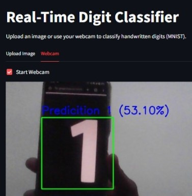

# Real-time-Digit-Classifier

This project implements a real-time digit classifier using the MNIST dataset. The model uses a Convolutional Neural Network (CNN) to classify digits (0-9) from images captured from a webcam feed in real time.It also includes a web interface where users can upload the digit or show the digit for webcam for real time digit prediction

## Features
- Real-time digit classification using a webcam.
- Utilizes a CNN model trained on the MNIST dataset.
- Predicts digits as the user displays them in front of the camera.
- Built with Python and OpenCV for real-time webcam interaction.
  
## Model Details

-  Architecture: Convolutional Neural Network (CNN)
-  Dataset: MNIST
- Layers:Convolutional layers
- Max pooling layers
- Output layer (softmax)

## Requirements
- Python 3.x
- OpenCV
- TensorFlow
- NumPy
- matplotlib
- scikit-learn

## Results

